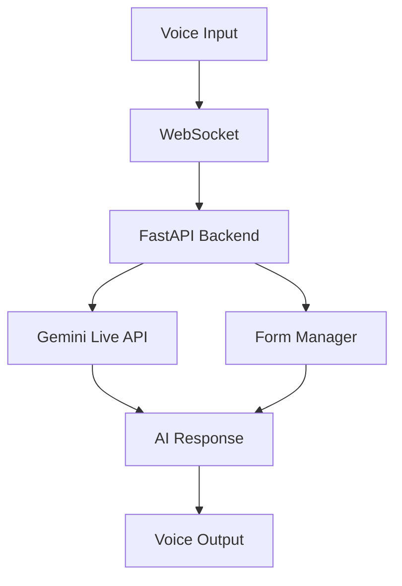

# Real-Time AI Voice Agent

Ultra-low latency conversational AI with sub-500ms voice-to-voice response time using Google Gemini Live API and optimized WebSocket architecture.

## ✨ Features

- **Sub-500ms latency**: Real-time voice conversation
- **Native audio streaming**: Direct audio processing without STT/TTS overhead
- **Natural interruption**: Interrupt and take turns naturally
- **Voice-controlled forms**: Fill forms using voice commands
- **Production-optimized**: Clean, fast, and reliable

## 🏗️ Architecture



## 🛠️ Tech Stack

**Backend**: FastAPI + Google Gemini Live + WebSocket + Python 3.11
**Frontend**: Next.js 14 + TypeScript + Tailwind CSS + Zustand
**Performance**: <500ms voice-to-voice, <2s connection setup

## 🚀 Quick Setup

### Prerequisites
- Python 3.8+
- Node.js 18+ 
- Google AI API key

### One-Command Setup
```bash
chmod +x setup-dev.sh && ./setup-dev.sh
```

### Manual Setup

**1. Backend:**
```bash
cd backend
python -m venv venv
source venv/bin/activate  # Windows: venv\Scripts\activate
pip install -r requirements.txt
cp .env.example .env
# Add your Google API key to .env
```

**2. Frontend:**
```bash
cd frontend
npm install
cp .env.example .env.local
```

**3. Start:**
```bash
# Terminal 1 - Backend
cd backend && source venv/bin/activate
python -m uvicorn app.main:app --reload --host 0.0.0.0 --port 8000

# Terminal 2 - Frontend  
cd frontend && npm run dev
```

**4. Access:**
- Frontend: http://localhost:3000
- API Docs: http://localhost:8000/docs

## 🔧 Configuration

**Backend (.env):**
```env
GOOGLE_API_KEY=your_google_api_key
HOST=0.0.0.0
PORT=8000
DEBUG=false
```

**Frontend (.env.local):**
```env
NEXT_PUBLIC_BACKEND_URL=ws://localhost:8000
NEXT_PUBLIC_ENABLE_FORM_FILLING=true
```

## 🎤 Usage

1. **Start**: Click microphone or say "Hello"
2. **Forms**: "Open contact form", "My name is John", "Submit form"
3. **Interrupt**: Speak anytime to interrupt the AI
4. **Monitor**: Check `/api/metrics` for performance stats

## 🔍 API Endpoints

- `GET /health` - System health and metrics
- `POST /api/voice/session` - Create voice session  
- `WS /ws/voice/{client_id}` - Voice WebSocket
- `WS /ws/rtvi/{client_id}` - RTVI Protocol
- `GET /api/metrics` - Performance metrics

## 🐛 Troubleshooting

**High Latency**: Check network, API key, WebSocket connection
**Audio Issues**: Verify browser microphone permissions
**Connection Failed**: Ensure backend on port 8000, check CORS

**Debug Mode:**
```bash
export DEBUG=true LOG_LEVEL=DEBUG          # Backend
export NEXT_PUBLIC_DEBUG_MODE=true         # Frontend
```

## 📈 Performance Targets

- Voice-to-Voice: <500ms
- Connection Setup: <2s
- Form Operations: <1s
- Memory Usage: <500MB

