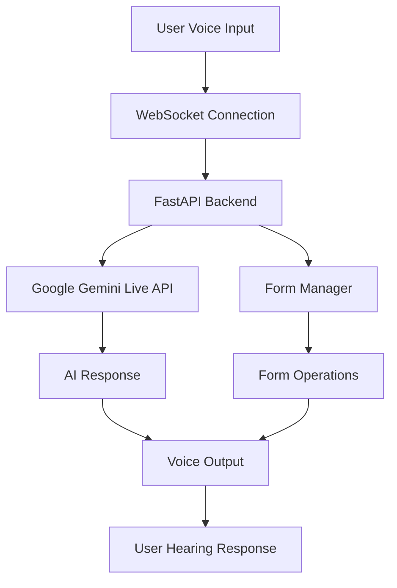

# Real-Time AI Voice Agent

A conversational AI system with ultra-low latency (<500ms) voice-to-voice communication using Google Gemini Live API and optimized WebSocket architecture.

## 🚀 Features

- **Ultra-low latency**: Sub-500ms voice-to-voice response time
- **Native audio streaming**: Direct audio processing without STT/TTS overhead  
- **Real-time conversation**: Natural interruption and turn-taking
- **Voice-controlled forms**: Fill and submit forms using voice commands
- **Production-ready**: Optimized for performance and reliability

## 🏗️ Architecture



## 🛠️ Tech Stack

### Backend
- **FastAPI**: High-performance async web framework
- **Google Gemini Live API**: Native audio processing AI
- **WebSocket**: Real-time bidirectional communication
- **Python 3.11**: Latest Python with performance optimizations

### Frontend  
- **Next.js 14**: React framework with App Router
- **TypeScript**: Type-safe development
- **Tailwind CSS**: Utility-first styling
- **Framer Motion**: Smooth animations
- **Zustand**: Lightweight state management

### Performance
- **Target Latency**: <500ms voice-to-voice
- **Connection Setup**: <2 seconds  
- **Tool Response**: <1 second for form operations
- **Audio Quality**: HD native streaming

## 🚀 Quick Start

### Prerequisites
- Python 3.8+ 
- Node.js 18+
- Google AI API key
- (Optional) Docker for containerized deployment

### Automated Setup (Recommended)

**Windows:**
```bash
.\setup-dev.bat
```

**Linux/Mac:**
```bash
chmod +x setup-dev.sh
./setup-dev.sh
```

### Manual Setup

1. **Clone and setup backend:**
```bash
cd backend
python -m venv venv
source venv/bin/activate  # On Windows: venv\Scripts\activate
pip install -r requirements.txt
cp .env.example .env
# Edit .env with your Google API key
```

2. **Setup frontend:**
```bash
cd frontend
npm install
cp .env.example .env.local
```

3. **Start development servers:**

Backend (Terminal 1):
```bash
cd backend
source venv/bin/activate
python -m uvicorn app.main:app --reload --host 0.0.0.0 --port 8000
```

Frontend (Terminal 2):
```bash
cd frontend
npm run dev
```

## 🚀 Quick Start (No Authentication)

**The simplest way to get started without any authentication setup:**

### 1. Setup Backend (No Auth)
```bash
cd backend
# Use the provided .env file (already configured)
# Just make sure you have a Google API key set

# Start server
D:\jibon\.venv\Scripts\python.exe -m uvicorn app.main:app --host 0.0.0.0 --port 8000 --reload
```

### 2. Setup Frontend
```bash
cd frontend
npm run dev
```

### 3. Access Application
- Frontend: http://localhost:3000
- Backend API: http://localhost:8000
- **No authentication required** - just start talking!

---

## 🔧 Configuration

### Backend (.env)
```env
# Google Gemini Live API
GOOGLE_API_KEY=your_google_gemini_api_key

# Server settings
HOST=0.0.0.0
PORT=8000
DEBUG=true

# Performance tuning
VOICE_ACTIVITY_TIMEOUT=0.5
INTERRUPTION_THRESHOLD=0.3
MAX_CONNECTIONS=100
```

### Frontend (.env.local)
```env
# Backend connection
NEXT_PUBLIC_BACKEND_URL=ws://localhost:8000

# Feature flags
NEXT_PUBLIC_ENABLE_FORM_FILLING=true
NEXT_PUBLIC_ENABLE_VOICE_INTERRUPTION=true
```

## 🎤 Usage

1. **Start Conversation**: Click the microphone button or say "Hello"

2. **Voice Commands**:
   - "I want to fill a contact form"
   - "My name is John Smith" 
   - "Set email to john@example.com"
   - "Submit the form"

3. **Interruption**: Start speaking anytime to interrupt the AI

4. **Form Types**:
   - Contact forms
   - Registration forms  
   - Feedback forms
   - Custom surveys

## 📊 Performance Monitoring

The application includes built-in performance monitoring:

- **Real-time latency tracking**
- **Connection quality metrics**
- **Audio quality indicators**
- **Form completion analytics**

Access metrics at: `http://localhost:8000/api/metrics`

## 🐳 Docker Deployment

### Development
```bash
docker-compose up --build
```

### Production
```bash
docker-compose --profile production up -d
```

Services:
- **Backend**: http://localhost:8000
- **Frontend**: http://localhost:3000
- **Redis**: localhost:6379 (caching)
- **Nginx**: http://localhost (production)

## 🧪 Testing

### Backend Tests
```bash
cd backend
pytest tests/ -v --cov=app
```

### Frontend Tests  
```bash
cd frontend
npm test
npm run test:e2e
```

### Performance Testing
```bash
cd backend
python -m pytest tests/test_performance.py -v
```

## 🔍 API Documentation

- **Interactive Docs**: http://localhost:8000/docs
- **OpenAPI Spec**: http://localhost:8000/openapi.json
- **Health Check**: http://localhost:8000/health

### Key Endpoints

- `GET /health` - System health and metrics
- `POST /api/voice/session` - Create voice session
- `WS /ws/voice/{client_id}` - WebSocket voice connection  
- `GET /api/forms/templates` - Available form templates
- `GET /api/metrics` - Performance metrics

## Troubleshooting

### Common Issues

**High Latency (>500ms)**:
- Check network connection
- Verify Google API key
- Monitor backend logs
- Check WebSocket connection

**WebSocket Connection Failed**:
- Ensure backend is running on port 8000
- Check firewall settings
- Verify CORS configuration

**Audio Issues**:
- Check browser microphone permissions
- Test with different browsers
- Verify audio device settings

**Form Filling Not Working**:
- Check console for errors
- Verify Gemini function calling
- Test with simple commands first

### Debug Mode

Enable debug logging:
```bash
# Backend
export DEBUG=true
export LOG_LEVEL=DEBUG

# Frontend  
export NEXT_PUBLIC_DEBUG_MODE=true
```


## Acknowledgments

- **Google Gemini Live API** for native audio processing
- **FastAPI** for high-performance backend framework
- **Next.js** for excellent frontend development experience
- **Tailwind CSS** for beautiful, responsive design

## 📈 Roadmap

- [x] Basic voice-to-voice conversation
- [x] Form filling with voice commands
- [x] Real-time interruption support
- [ ] Multi-language support
- [ ] Voice authentication
- [ ] Custom voice models
- [ ] Mobile app integration
- [ ] Advanced analytics dashboard

