# Ultra-Low Latency AI Voice Agent

**Real-time conversational AI** with sub-500ms voice-to-voice response time using Google Gemini Live API, Pipecat AI framework, and RTVI protocol.

## ✨ Key Features

- **🎯 Ultra-Low Latency**: Sub-500ms voice-to-voice response time
- **🎤 Native Audio Streaming**: Direct audio processing with Pipecat AI framework
- **⚡ Real-time Interruption**: Natural conversation flow with instant interruption support
- **📝 Voice-Controlled Forms**: Fill and submit forms using voice commands
- **🔄 WebSocket Architecture**: Optimized real-time communication
- **🎨 Modern UI**: Next.js 14 with Tailwind CSS and smooth animations
- **📊 Performance Monitoring**: Real-time latency and connection metrics

## 🏗️ System Architecture

```mermaid
graph TB
    A[🎤 Voice Input] --> B[📡 WebSocket Connection]
    B --> C[FastAPI Backend]
    C --> D[Pipecat AI Agent]
    D --> E[Google Gemini Live]
    C --> F[Form Manager]
    E --> G[Audio Response]
    F --> G
    G --> H[Voice Output]
    
    I[⚙️ RTVI Protocol] --> B
    J[📊 Performance Monitor] --> C
```



## 🛠️ Technology Stack

| Component | Technology | Purpose |
|-----------|------------|---------|
| **Backend** | FastAPI + Python 3.11 | High-performance async API server |
| **AI Framework** | Pipecat AI + RTVI | Real-time voice AI pipeline |
| **AI Model** | Google Gemini Live API | Advanced conversational AI |
| **Frontend** | Next.js 14 + TypeScript | Modern React framework |
| **Styling** | Tailwind CSS + Framer Motion | Responsive design + animations |
| **State Management** | Zustand | Lightweight state management |
| **Communication** | WebSocket + RTVI Protocol | Real-time bidirectional communication |

## 🚀 Quick Start Guide

### Prerequisites

Before getting started, ensure you have:

- **Python 3.8+** (recommended: 3.11)
- **Node.js 18+** 
- **Google AI Studio API Key** ([Get one here](https://aistudio.google.com/))
- **Modern browser** with microphone access

### ⚡ Automated Setup (Recommended)

**Windows:**
```cmd
setup-dev.bat
```

**Linux/macOS:**
```bash
chmod +x setup-dev.sh && ./setup-dev.sh
```

### 🔧 Manual Setup

#### 1. Clone & Navigate
```bash
git clone <repository-url>
cd Low-Latency-AI-Voice-Agent
```

#### 2. Backend Setup
```bash
cd backend

# Create virtual environment
python -m venv venv

# Activate environment
# Windows:
venv\Scripts\activate
# Linux/macOS:
source venv/bin/activate

# Install dependencies
pip install -r requirements.txt

# Configure environment
copy .env.example .env     # Windows
cp .env.example .env       # Linux/macOS

# Edit .env and add your Google API key:
# GOOGLE_API_KEY=your_actual_api_key_here
```

#### 3. Frontend Setup
```bash
cd ../frontend

# Install Node.js dependencies
npm install

# Configure environment
copy .env.example .env.local     # Windows
cp .env.example .env.local       # Linux/macOS
```

#### 4. Start the Application

**Terminal 1 - Backend:**
```bash
cd backend
# Activate venv if not already active
source venv/bin/activate  # Linux/macOS
# or
venv\Scripts\activate     # Windows

# Start FastAPI server
python -m uvicorn app.main:app --reload --host 0.0.0.0 --port 8000
```

**Terminal 2 - Frontend:**
```bash
cd frontend
npm run dev
```

#### 5. Access the Application

- **Frontend Interface**: http://localhost:3000
- **API Documentation**: http://localhost:8000/docs
- **Health Check**: http://localhost:8000/health

## ⚙️ Configuration

### Backend Configuration (.env)

```env
# Required: Google AI Studio API Key
GOOGLE_API_KEY=your_google_api_key_here

# Server Settings
HOST=0.0.0.0
PORT=8000
DEBUG=false
LOG_LEVEL=INFO

# Feature Flags
ENABLE_AUTH=false
TEST_MODE=true
```

### Frontend Configuration (.env.local)

```env
# Backend WebSocket URL
NEXT_PUBLIC_BACKEND_URL=ws://localhost:8000

# Application Settings
NEXT_PUBLIC_APP_NAME="Ultra-Fast Voice Agent"
NEXT_PUBLIC_APP_VERSION=1.0.0

# Performance Settings
NEXT_PUBLIC_ENABLE_PERFORMANCE_MONITORING=true
NEXT_PUBLIC_TARGET_LATENCY_MS=500

# Feature Flags
NEXT_PUBLIC_ENABLE_FORM_FILLING=true
NEXT_PUBLIC_ENABLE_VOICE_INTERRUPTION=true
NEXT_PUBLIC_ENABLE_REAL_TIME_METRICS=true
```

## 🎤 How to Use

### Basic Voice Interaction
1. **🎯 Start Conversation**: Click the microphone button or say "Hello"
2. **💬 Natural Chat**: Speak naturally - the AI responds in real-time
3. **⚡ Interrupt Anytime**: Start speaking to interrupt the AI mid-response
4. **🔄 Continuous Flow**: Maintain natural conversation rhythm

### Voice-Controlled Forms
1. **📝 Activate Forms**: Say "Open contact form" or "Show me the form"
2. **✍️ Fill Fields**: "My name is John Smith", "Email is john@example.com"
3. **📤 Submit**: "Submit the form" or "Send it"
4. **🔍 Review**: "Read back my information"

### Advanced Features
- **📊 Performance Monitor**: Check real-time latency in the UI
- **🎛️ Settings Panel**: Adjust voice sensitivity and response speed
- **📱 Mobile Friendly**: Works on mobile browsers with touch controls

## 🔍 API Documentation

### Core Endpoints

| Method | Endpoint | Description | Response |
|--------|----------|-------------|----------|
| `GET` | `/health` | System health check with metrics | Health status + performance data |
| `GET` | `/api/metrics` | Detailed performance metrics | Latency, connections, uptime |
| `POST` | `/api/voice/session` | Create new voice session | Session ID and config |
| `WS` | `/ws/voice/{client_id}` | Voice WebSocket connection | Real-time audio stream |
| `WS` | `/ws/rtvi/{client_id}` | RTVI protocol connection | RTVI-compatible stream |

### WebSocket Message Format

**Client → Server:**
```json
{
  "type": "audio_data",
  "data": "base64_encoded_audio",
  "timestamp": 1234567890,
  "client_id": "unique_client_id"
}
```

**Server → Client:**
```json
{
  "type": "audio_response", 
  "data": "base64_encoded_audio",
  "latency_ms": 245,
  "confidence": 0.95
}
```

### Performance Metrics Endpoint

`GET /api/metrics` returns:
```json
{
  "voice_to_voice_latency_ms": 387,
  "connection_setup_time_ms": 1250,
  "active_connections": 12,
  "total_sessions": 1847,
  "uptime_seconds": 86400,
  "memory_usage_mb": 256
}
```

## 🐛 Troubleshooting

### Common Issues & Solutions

#### 🔧 High Latency (>500ms)
**Symptoms**: Slow voice responses, delayed audio
**Solutions**:
- ✅ Check internet connection speed (minimum 10 Mbps)
- ✅ Verify Google API key is valid and has quota
- ✅ Ensure WebSocket connection is stable
- ✅ Close other bandwidth-heavy applications
- ✅ Check `/api/metrics` for performance bottlenecks

#### 🎤 Audio Input Issues
**Symptoms**: Microphone not detected, no audio input
**Solutions**:
- ✅ Grant microphone permissions in browser
- ✅ Check browser compatibility (Chrome/Edge recommended)
- ✅ Test microphone in other applications
- ✅ Disable browser audio enhancements
- ✅ Try incognito/private browsing mode

#### 🌐 Connection Problems
**Symptoms**: "Connection failed", WebSocket errors
**Solutions**:
- ✅ Verify backend is running on port 8000
- ✅ Check CORS settings in backend configuration
- ✅ Disable browser extensions that block WebSockets
- ✅ Try different browser or device
- ✅ Check firewall/antivirus settings

#### 📝 Form Filling Not Working
**Symptoms**: Voice commands not filling forms
**Solutions**:
- ✅ Ensure `NEXT_PUBLIC_ENABLE_FORM_FILLING=true` in frontend `.env.local`
- ✅ Speak clearly and wait for acknowledgment
- ✅ Use specific phrases: "My name is..." "Email is..."
- ✅ Check browser console for JavaScript errors

### 🔍 Debug Mode

Enable detailed logging for troubleshooting:

**Backend Debug:**
```bash
# Edit backend/.env
DEBUG=true
LOG_LEVEL=DEBUG

# Restart backend server
```

**Frontend Debug:**
```bash
# Edit frontend/.env.local
NEXT_PUBLIC_DEBUG_MODE=true

# Check browser developer console for detailed logs
```

### 📊 Performance Monitoring

Monitor real-time performance:
- **Frontend**: Performance panel in the UI shows live metrics
- **Backend**: Visit `http://localhost:8000/api/metrics` for detailed stats
- **Logs**: Check terminal output for connection and processing times

### 🆘 Getting Help

If issues persist:
1. **📋 Check Logs**: Review terminal output for error messages
2. **🌐 Test Connectivity**: Verify `http://localhost:8000/health` returns 200
3. **🔄 Restart Services**: Stop and restart both backend and frontend
4. **📱 Try Different Device**: Test on another device/browser
5. **📞 Environment Reset**: Delete `.env` files and reconfigure

## 📈 Performance Targets & Benchmarks

### 🎯 Target Performance Metrics

| Metric | Target | Excellent | Acceptable | Poor |
|--------|--------|-----------|------------|------|
| **Voice-to-Voice Latency** | <500ms | <300ms | <500ms | >500ms |
| **Connection Setup** | <2s | <1s | <2s | >2s |
| **Form Operation** | <1s | <500ms | <1s | >1s |
| **Memory Usage** | <500MB | <300MB | <500MB | >500MB |
| **CPU Usage** | <50% | <30% | <50% | >50% |

### 🏆 Optimization Features

- **⚡ Pipecat AI Framework**: Optimized voice processing pipeline
- **🔄 WebSocket Streaming**: Eliminates HTTP request overhead
- **📦 Audio Compression**: Reduces bandwidth usage
- **🧠 Smart Buffering**: Minimizes audio dropouts
- **🎯 Edge Computing**: Processing close to users
- **📊 Real-time Monitoring**: Continuous performance tracking

### 🔧 Performance Tuning

**For Better Latency:**
```env
# Backend optimizations
LOG_LEVEL=WARNING  # Reduce logging overhead
TEST_MODE=false    # Disable test delays
```

**For Better Stability:**
```env
# Increase connection timeouts
WEBSOCKET_TIMEOUT=30
MAX_CONNECTIONS=100
```

## 🏗️ Project Structure

```
Low-Latency-AI-Voice-Agent/
├── 📁 backend/                 # FastAPI backend application
│   ├── 📁 app/                # Main application code
│   │   ├── 🔧 main.py         # FastAPI app with WebSocket endpoints
│   │   ├── ⚙️ config.py       # Configuration and settings
│   │   ├── 🤖 voice_agent.py  # Core voice agent logic
│   │   ├── 🎯 complete_pipecat_agent.py  # Full Pipecat integration
│   │   ├── 📁 services/       # Service layer
│   │   │   ├── 🔮 gemini_live_service.py    # Google Gemini integration
│   │   │   └── 🎵 audio_stream_processor.py # Audio processing
│   │   └── 📁 tools/          # Utility tools
│   │       └── 📝 form_manager.py # Voice-controlled forms
│   ├── 📋 requirements.txt    # Python dependencies
│   ├── 🔧 .env.example       # Environment template
│   └── 🐳 Dockerfile         # Container configuration
├── 📁 frontend/               # Next.js frontend application
│   ├── 📁 src/               # Source code
│   │   ├── 📁 app/           # Next.js app directory
│   │   │   ├── 🏠 page.tsx   # Main application page
│   │   │   └── 🎨 layout.tsx # App layout and styling
│   │   ├── 📁 components/    # React components
│   │   │   ├── 🎤 VoiceInterface.tsx    # Main voice UI
│   │   │   └── 📝 FormManager.tsx       # Form management UI
│   │   ├── 📁 lib/           # Utility libraries
│   │   │   ├── 🎵 audio-manager.ts     # Audio handling
│   │   │   ├── 🔗 rtvi-client.ts       # RTVI protocol client
│   │   │   └── 🏪 store.ts             # Zustand state management
│   │   └── 📁 styles/        # CSS and styling
│   │       └── 🎨 globals.css # Global styles and themes
│   ├── 📦 package.json       # Node.js dependencies
│   ├── ⚙️ next.config.js     # Next.js configuration
│   ├── 🎨 tailwind.config.js # Tailwind CSS setup
│   └── 🔧 .env.example       # Environment template
├── 🐳 docker-compose.yml     # Docker orchestration
├── 🚀 setup-dev.sh          # Quick setup script (Linux/macOS)
├── 🚀 setup-dev.bat         # Quick setup script (Windows)
├── 📖 README.md             # This documentation
└── 📄 LICENSE               # MIT License
```

## 🤝 Contributing

We welcome contributions! Here's how to get started:

### 🔧 Development Setup
1. **Fork the repository**
2. **Clone your fork**: `git clone <your-fork-url>`
3. **Follow the setup guide** above
4. **Create a feature branch**: `git checkout -b feature/amazing-feature`
5. **Make your changes** and test thoroughly
6. **Submit a pull request** with detailed description

### 📋 Code Standards
- **Python**: Follow PEP 8, use type hints
- **TypeScript**: Strict mode, proper typing
- **Commits**: Use conventional commit messages
- **Testing**: Add tests for new features
- **Documentation**: Update README for new features

### 🎯 Areas for Contribution
- **🚀 Performance Optimization**: Reduce latency further
- **🎨 UI/UX Improvements**: Better user interface
- **🔧 Additional AI Models**: Support for other providers
- **📱 Mobile Enhancements**: Native mobile app
- **🌐 Internationalization**: Multi-language support
- **📊 Analytics**: Advanced performance metrics

## 📄 License

This project is licensed under the **MIT License** - see the [LICENSE](LICENSE) file for details.

## 🙏 Acknowledgments

- **[Pipecat AI](https://pipecat.ai/)** - Excellent real-time voice AI framework
- **[Google Gemini](https://ai.google.dev/)** - Powerful conversational AI model
- **[RTVI Protocol](https://github.com/rtvi-ai)** - Real-time voice interface standard
- **[FastAPI](https://fastapi.tiangolo.com/)** - Modern Python web framework
- **[Next.js](https://nextjs.org/)** - React framework for production

---

**🚀 Ready to build ultra-fast voice AI? Get started now!** 

Need help? Check our [troubleshooting guide](#-troubleshooting) or open an issue.

